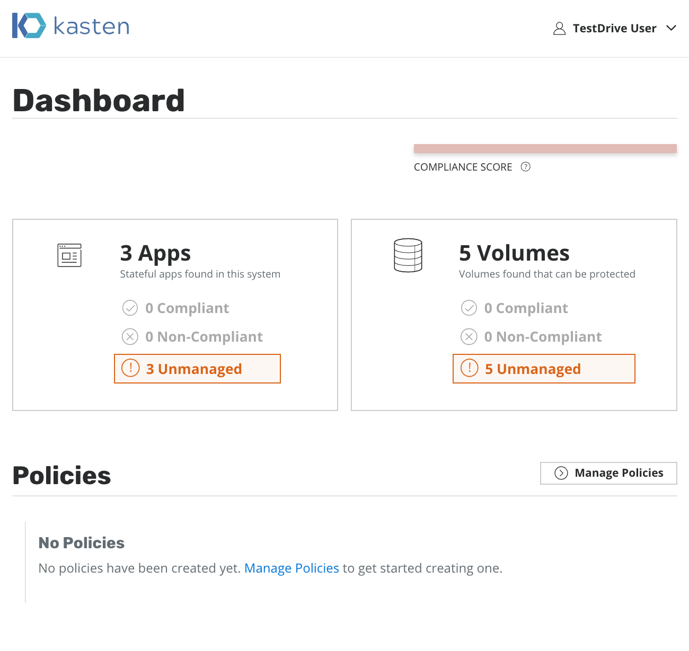

.. include:: <isonum.txt>

.. _testdrive:

Test Drive
==========
**TODO: REFACTOR ALL OF THIS**

Getting Started
---------------

We have setup a test Kubernetes cluster in either GKE or AWS for you
with a sample application to experiment with. However, we encourage
you to install your own applications too.

We would like you to perform the actions required to transition into a
100% compliant state (more on that below) as well as deploy other
sample applications to see how they behave.

.. warning:: Our test drive clusters should **not** be used for production
   as they can be torn down or updated in a destructive manner. Please do
   not install applications or data there that you care about. You will
   likely lose them.

.. note:: Please view the current system's :ref:`restrictions` first
  as certain features have been disabled for this version.

Our goal during the first part of the test drive will be to bring the
system into compliance by defining policies to protect pre-existing
applications.

Test Drive Quick Start
++++++++++++++++++++++

Kasten Dashboard
----------------

To access the test cluster setup for you, please refer to your welcome
email. It contains:

* The cluster URLs (e.g., ``https://your-testdrive-url.example.com/``)
  for two Kubernetes clusters
* Username/password cluster credentials
* The kubernetes configuration for ``kubectl`` to deploy any of your
  sample applications

To verify connectivity, please go directly to the provided URLs and see
if the K10 dashboard loads for you. If successful, you will see an
image that looks like this:

Picture Gallery (Sample App)
----------------------------

You can access the sample picture-gallery application at
``https://your-testdrive-url.example.com/picture-gallery`` by clicking
on the top left portion of the screen and using these credentials:

* **login**: testdrive_user
* **password**: test_password

This multi-volume application can be used to experiment with snapshots,
restores, and migration.

   .. image:: ./_static/gallery_default.png

Accessing the Kubernetes Dashboard
----------------------------------

The Kubernetes dashboard can be accessed at
``https://your-testdrive-url.example.com/dashboard/``. While it does
not need any credentials and only allows access to the default
namespace, do note that we have observed upstream dashboard bugs
where restricted RBAC permissions sometimes bounce the browser
back to the main landing page.

Modifying Application State
---------------------------

If you are using your own application or data service, please follow
application-specific methods for mutating state in the underlying data
stores.

If you are using the picture gallery application for experimentation,
log into your picture-gallery application at
``https://your-testdrive-url.example.com/picture-gallery`` by clicking
on the top left portion of the screen and using these credentials:

* **login**: testdrive_user
* **password**: test_password

At this point, you should see something like this:

   .. image:: ./_static/gallery_default.png

You can upload a new image or simply delete all images by clicking on
the Unsorted album |rarr| Clicking the Trash icon in the top right
corner |rarr| Selecting Clear Unsorted. At this point, the gallery
should be empty and look like this:

   .. image:: ./_static/gallery_empty.png

Restoring Applications to a Pristine State
------------------------------------------

Restoring the selected application is also accomplished via the
applications page. Click to expose the dropdown and select ``Restore
App``

   .. image:: ./_static/namespaces_manual.png

At that point, you will have an option to pick a Restore Point, a
grouped collection of data artifacts belonging to the application, to
restore from. This view also easily distinguishes manually generated
restore points from automated policy-generated ones.

   .. image:: ./_static/gallery_restore.png

Selecting a restore point will bring up a side-panel containing more
details on the restore point.

   .. image:: ./_static/gallery_restore_panel.png

Once you click ``Restore``, the system will automatically recreate the
entire application stack.

.. note:: Restore can take a few minutes as this depends on the amount
  of data captured by the restore point. The restore time is dominated
  by how long it takes to rehydrate this data in the underlying cloud
  provider followed by recreating the application containers. Please
  be patient.

After restore completes, you will be able to go back to your
application and verify that the state was restored to what existed at
the time the restore point was obtained.

In case of the picture gallery application, re-login to the picture
gallery and you will observe that the state is as it was at the time
the selected snapshot was taken:

   .. image:: ./_static/gallery_default.png

In case of the picture gallery application, re-login to the picture
gallery and you will observe that the state is as it was at the time
the selected snapshot was taken:

   .. image:: ./_static/gallery_default.png

If you have deployed Kasten into your own clusters, you will be able
to test migration by combining multiple of the above options. If you
are using our testdrive system, that is currently setup to enable
cross-cluster migration but can be easily modified to support the
others too.

.. toctree::

   self
   custom

.. spelling::
   Username
